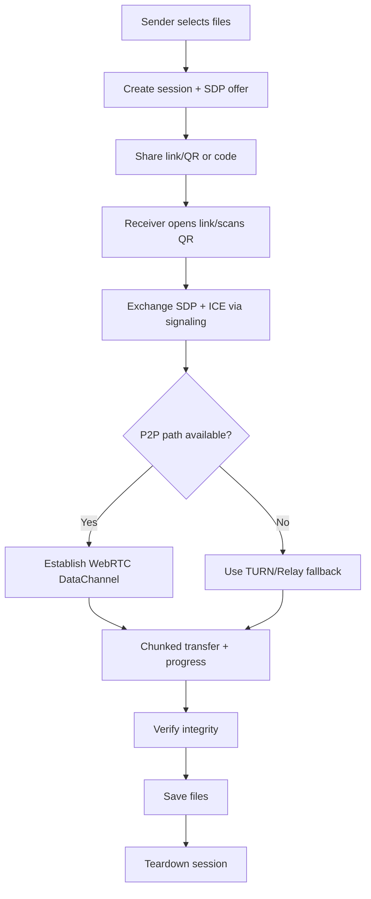
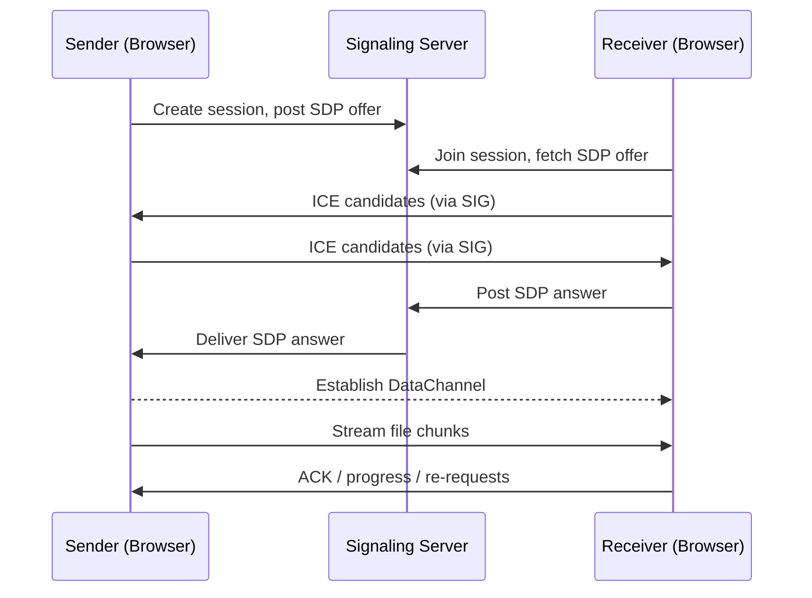

# TriDrop — Effortless Cross‑Share Between iPhone and Windows

Tons of GBs across devices shouldn’t be painful. While I use an iPhone, Windows file sharing often makes me go crazy. I vibecoded this small project to make cross‑sharing simple: anyone can share files peer‑to‑peer (or via a relay fallback) by just connecting devices on the same network or over the internet with a one‑time code or QR.

## What Is TriDrop?
- Simple, browser‑based file transfer between phones and PCs.
- Zero install for receivers: open a link or scan a QR.
- Prefers local, fast peer‑to‑peer; falls back to a relay if needed.

## Why TriDrop?
- Cross‑OS pain: iPhone ↔ Windows is clunky for big files.
- USB cables, drivers, or cloud uploads are slow and annoying.
- This aims for near‑zero setup: open page → connect → send.

## How It Works (Technology)
- WebRTC DataChannels: Primary data path for fast, direct P2P transfers.
- Signaling: A lightweight WebSocket signaling service to exchange session descriptions/ICE candidates. For fully offline LANs, signaling can be bootstrapped using a temporary shared code or by scanning a QR that encodes the SDP offer.
- STUN/TURN: STUN helps peers discover public addresses; TURN relays when NATs/Firewalls block direct connections.
- Chunked Transfer + Integrity: Files are chunked for resilience; each chunk can be hashed (e.g., SHA‑256) to ensure integrity and support resume.
- Optional Relay Upload: If peers cannot connect P2P, a temporary relay server can stream encrypted chunks from sender to receiver.
- PWA Friendly: Works as a Progressive Web App; can be installed on mobile for quick access.

### Web Technologies
- HTML5, CSS, JavaScript
- WebRTC (DataChannels), WebSocket (signaling)
- Service Worker (offline caching, PWA shell)
- WebCrypto (hashing, optional E2E encryption)
- File APIs (file slicing/streams)
- Web Share / Share Target (where supported)

### Other Technologies (Server‑Side / Infra)
- Signaling server (Node.js + `ws` or any WS framework)
- STUN/TURN (e.g., Google STUN, Coturn for TURN)
- Optional relay server (Node/Express + streams)
- QR code generation (e.g., `qrcode` library)

## Flowcharts



### Signaling Sequence (Simplified)



## Methodology
- Start with browser‑only MVP (static hosting) and a minimal hosted signaling endpoint.
- Optimize for LAN first (fastest + simplest path), then robust NAT traversal.
- Add chunking, hashing, resume, and parallelism for large files.
- Harden with encryption and configurable retention (delete session after transfer).

## Features
- Cross‑device sharing (iPhone ↔ Windows and more)
- QR/connect code pairing
- P2P by default, TURN/relay fallback
- Large file support with chunking and resume attempts
- Transfer progress, cancel/retry
- Optional link expiration and auto‑cleanup
- PWA installable experience on mobile

## Local Development

You can serve this static site quickly during development:

```bash
# Option 1: Python
python -m http.server 5500 -b 127.0.0.1

# Option 2: VS Code Live Server extension
# Click "Go Live" in the status bar
```

## Roadmap
- Minimal WS signaling service (Node)
- Basic sender/receiver UI flows
- Chunked send/receive with progress UI
- QR code pairing + short code session lookup
- TURN/relay fallback
- Optional end‑to‑end encryption
- PWA enhancements and install prompts

## Security Considerations
- Session codes must be high‑entropy and short‑lived.
- Avoid logging any file content or cryptographic material on servers.
- Prefer E2E encryption, even when using a relay/TURN.
- Validate chunk ordering and hashes; handle timeouts and retries safely.

## About Me
I enjoy building pragmatic tools that remove friction from everyday workflows—especially where different ecosystems meet. This project started as a personal itch: fast, hassle‑free sharing between an iPhone and a Windows PC.

## License
MIT
